# Infrastructure-Management-Automation-Platform

* [Infrastructure\-Management\-Automation\-Platform](#infrastructure-management-automation-platform)
  * [핵심 성과](#핵심-성과)
  * [Overview](#overview)
  * [주요 기능](#주요-기능)
    * [1\. 홈 대시보드](#1-홈-대시보드)
    * [2\. 리소스 요약](#2-리소스-요약)
    * [3\. S\-Code 트리맵 (인프라 코드 분류)](#3-s-code-트리맵-인프라-코드-분류)
    * [4\. VM 브라우저 (CMDB)](#4-vm-브라우저-cmdb)
    * [5\. VM 프로비저닝](#5-vm-프로비저닝)
    * [6\. VM 생성](#6-vm-생성)
    * [7\. 볼륨 생성 / 연결](#7-볼륨-생성--연결)
    * [8\. 서브넷 연결 상태 모니터링](#8-서브넷-연결-상태-모니터링)
    * [9\. IAM 관리](#9-iam-관리)
    * [10\. 인프라 코드 관리](#10-인프라-코드-관리)
    * [11\. 프로젝트 관리](#11-프로젝트-관리)
    * [12\. 패치 노트](#12-패치-노트)
    * [13\. 인증 — 2FA 및 라이트 모드](#13-인증--2fa-및-라이트-모드)
  * [Architecture](#architecture)
  * [File Structure](#file-structure)
  * [DB Schema (주요 테이블)](#db-schema-주요-테이블)
  * [Background Threads](#background-threads)
  * [Security](#security)
  * [Tech Stack](#tech-stack)

> KakaoCloud 환경에서 **1,000개 이상의 VM**을 운영하는 인프라팀을 위해 자체 개발한 사내 인프라 관리 플랫폼.  
> VM · Kubernetes · Load Balancer · Volume · IAM · DNS 등 클라우드 리소스의 통합 관리 및 자동화를 단일 웹 인터페이스로 구현. 2025 ~ 2026 개발 및 운영.

---

## 핵심 성과

| 항목 | Before | After | 개선율 |
|---|---|---|---|
| Volume 생성·Mount 작업 시간 | 건당 약 10초 | 건당 약 1초 | **90% 단축** |
| 네트워크 연결성 체크 실행 시간 | 약 8초 (순차) | 약 4초 (병렬) | **50% 단축** |
| VM 생성 | 콘솔 수동 클릭 (다단계) | API 기반 원클릭 자동화 | **인적 오류 제거** |
| VM 프로비저닝 (기본 설정) | 수동 SSH 접속 후 개별 설정 | Ansible + Puppet 자동화 | **인적 오류 제거** |
| 관리 대상 VM | — | 1,000개+ | — |
| 관리 대상 리소스 유형 | — | VM · K8s · LB · Volume · IAM · DNS | — |

- **S-Code 도입** — 1,000개+ VM을 서비스 코드 기반으로 자동 분류·담당자 지정·일별 변동 추적 가능. 도입 전에는 VM별 소유자·용도를 수동으로 파악해야 했으나, S-Code 규칙 엔진으로 자산별 관리 체계 구현
- Volume API 자동화로 생성·마운트 작업을 웹 UI 원클릭으로 처리, 수동 콘솔 작업 대비 대폭 단축
- 네트워크 연결성 체크를 `ThreadPoolExecutor(max_workers=30)` 병렬 처리로 개선
- 2FA(Google OTP) · CSRF · 감사로그 적용으로 인프라 관리 시스템의 보안성·추적성 강화
- Ansible·Puppet 실행 이력 및 인프라 변경 이력을 Audit/History로 전수 기록

---

## Overview

| 항목 | 내용 |
|---|---|
| **수행 기간** | 2025 ~ 2026 |
| **관리 대상** | VM · Kubernetes 노드 · Load Balancer · Volume · IAM · DNS |
| **플랫폼** | KakaoCloud (Ubuntu 24.04 / 22.04 / Rocky Linux 9) |
| **백엔드** | Python 3 · Flask · Celery · SQLite · Redis |
| **인증** | TOTP 2FA · 역할 기반 접근 제어 (admin / operator / viewer) |
| **비동기** | Celery + Redis (볼륨 생성/연결 대규모 작업) |
| **연동** | Ansible · Puppet · AWS Route53 · Prometheus |
| **관련 프로젝트** | [Ansible 자동화](https://github.com/HyunsGit/Automating-Infrastructure-with-Ansible) · [Puppet 드리프트 감지](https://github.com/HyunsGit/Detecting-Drifts-in-Infrastructure-with-Puppet) · [통합 모니터링 자동화](https://github.com/HyunsGit/Centralized-Monitoring) |

---

## 주요 기능

### 1. 홈 대시보드

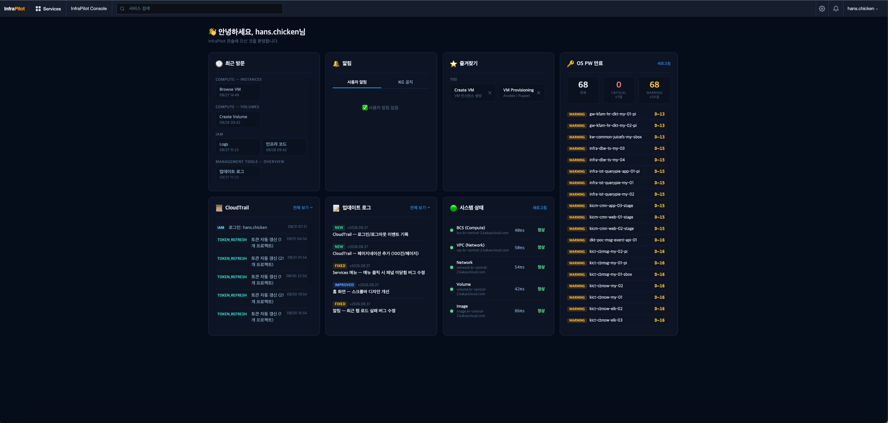

최근 방문 페이지, 즐겨찾기, 미해소 알림, CloudTrail 로그, KakaoCloud 공지사항을 한 화면에 통합.  
페이지 방문 시 자동으로 활동 이력을 기록하고, 사용자별 최근 6개 페이지를 추적함.

---

### 2. 리소스 요약

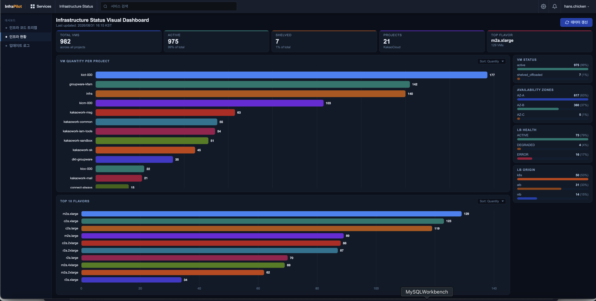

VM / Kubernetes 노드 / Load Balancer 현황을 Cloud API 기반으로 자동 수집하고, 프로젝트별·AZ별·상태별·flavor별로 집계해 차트로 시각화.

| 리소스 | 수집 방식 | 집계 항목 |
|---|---|---|
| **VM** | KakaoCloud BCS API (페이지네이션) | 상태·AZ·프로젝트·flavor·OS·S-Code |
| **Kubernetes 노드** | VM 목록에서 image 기반 자동 분류 | VM과 동일 파이프라인, K8s 노드 별도 태깅 |
| **Load Balancer** | KakaoCloud LB API | ALB·NLB·K8s Service LB 분류, ACTIVE·DEGRADED·ERROR 상태 집계 |

CSV 기반 일별 스냅샷과 실시간 API를 병행해 데이터 정확도를 유지하며, CMDB와 연계함.

---

### 3. S-Code 트리맵 (인프라 코드 분류)

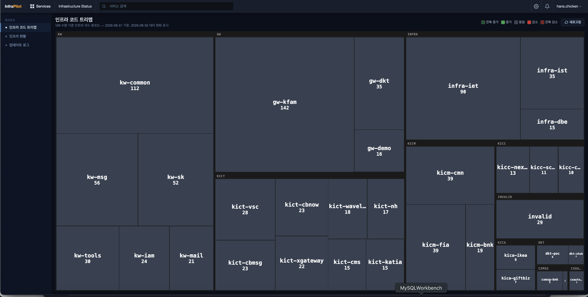

VM 이름에서 인프라 코드(S-Code)를 자동으로 추출해 트리맵으로 시각화.  
전일 스냅샷과 비교해 VM 증감(추가/삭제)을 실시간으로 추적함.

**S-Code 규칙 엔진:**
- `contains` / `contains_all` / `startswith` / `endswith` / `exact` 5가지 매칭 방식
- 우선순위 기반 규칙 평가 — DB에서 동적으로 로드해 재배포 없이 수정 가능
- 매일 오전 7시 KST 자동 스냅샷 → 전일 대비 diff 계산

---

### 4. VM 브라우저 (CMDB)

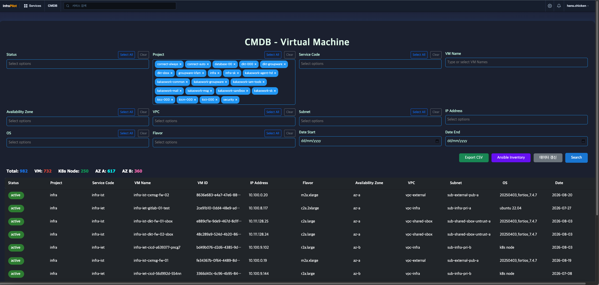

전 프로젝트 VM · Kubernetes 노드를 멀티필터(프로젝트·S-Code·OS·AZ·VPC·서브넷·상태)로 검색.  
필터 결과를 프로젝트명 기반 파일명으로 CSV 즉시 다운로드 가능. Load Balancer 현황(ALB·NLB·K8s Service LB)도 별도 집계해 리소스 요약 페이지에 통합 표시.

```
KakaoCloud API → 병렬 조회 (ThreadPoolExecutor)
    → S-Code 규칙 재계산 → 필터 적용
    → JSON 응답 / CSV 다운로드
```

---

### 5. VM 프로비저닝

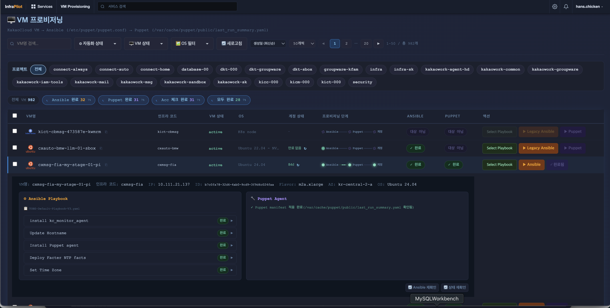

신규 VM 투입 시 Ansible + Puppet 실행을 웹 UI에서 원클릭으로 수행하고,  
**Server-Sent Events(SSE)** 로 플레이북 출력을 실시간 스트리밍함.

**프로비저닝 흐름:**

```
VM 목록 조회 (Redis 캐시, TTL 60초)
    → OS 타입 판별 (ubuntu24 / legacy / skip)
    → Ansible 플레이북 선택 (TOBE-Default or Default-Playbook-V3)
    → 임시 인벤토리 생성 → ansible-playbook 실행 → SSE 스트리밍
    → (ubuntu24) Puppet 인증서 요청 → Master 서명 → agent -t 적용
```

**단계별 상태 검증:**
- `kic_monitor_agent`, `node_exporter`, `promtail`, Filebeat 설치 여부
- 호스트명, Timezone, NTP, DNS, ulimit, sudoers 설정 확인
- Puppet 인증서 상태 (`none` / `requested` / `signed`)
- SSH 패스워드 만료일 (KST 변환, 30일 이내 알림)

**일괄 프로비저닝:**
- 복수 VM 선택 → OS 타입별 자동 그룹화 → 병렬 Ansible 실행
- Redis 토큰으로 URL 길이 제한 우회 (40+ VM 지원)

---

### 6. VM 생성

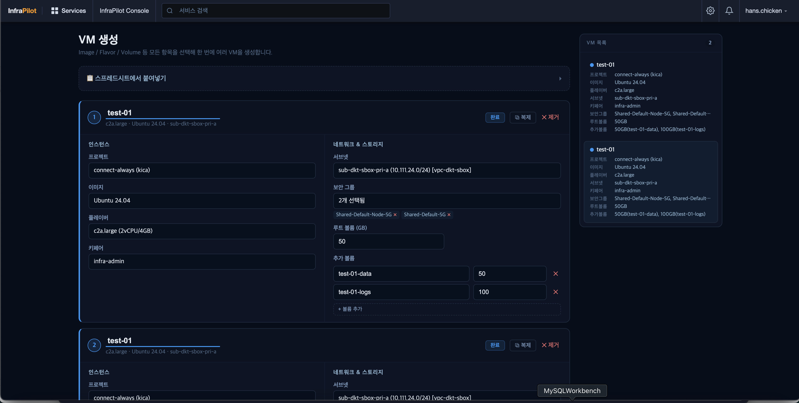

KakaoCloud API를 직접 호출해 인스턴스와 추가 볼륨을 함께 생성.  
프로젝트 선택 시 서브넷·보안그룹·키페어·flavor·이미지 목록을 병렬로 조회해 드롭다운 자동 구성.

```python
# 리소스 목록 병렬 조회 (6개 엔드포인트 동시 호출)
with ThreadPoolExecutor(max_workers=6) as ex:
    futures = {ex.submit(fn): key for key, fn in tasks.items()}
```

- Rate limit 발생 시 지수 백오프 자동 재시도
- 볼륨 생성 → 상태 polling (`available` 대기) → 인스턴스 생성 순 실행
- 생성 완료 즉시 Redis 캐시 무효화 → 프로비저닝 페이지에 즉시 반영

---

### 7. 볼륨 생성 / 연결

| 볼륨 생성 | 볼륨 연결 | 볼륨 브라우저 |
|---|---|---|
| 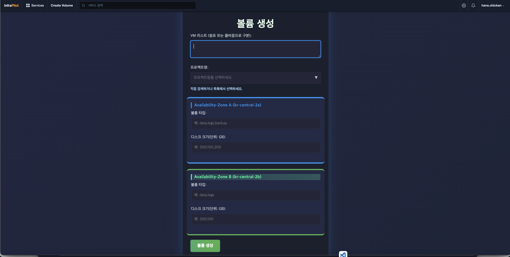 | 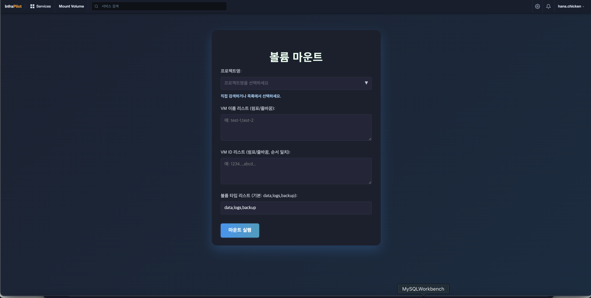 | 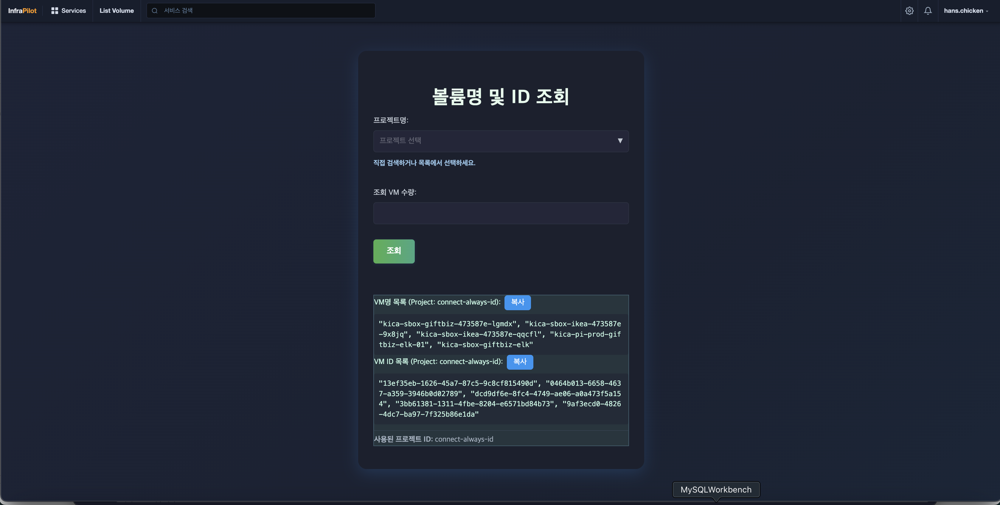 |

**볼륨 생성** — VM 목록과 AZ를 기반으로 Zone A/B 각각 볼륨 타입·크기 지정.  
**볼륨 연결** — VM명→볼륨명 자동 매핑 후 인스턴스에 연결.  
두 작업 모두 **Celery 비동기 태스크**로 처리 — 대용량 작업 시 UI 블록킹 없음.

```
POST /create_volumes → celery task → 진행률 실시간 업데이트 (PROGRESS state)
POST /attach_volumes → celery task → 429 rate limit 시 지수 백오프 재시도
```

---

### 8. 서브넷 연결 상태 모니터링

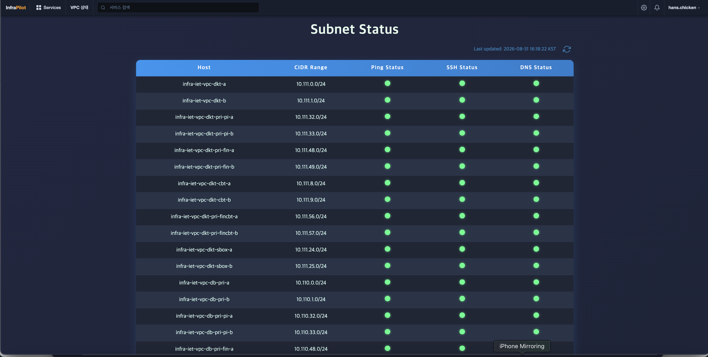

운영 중인 VPC 서브넷 전체를 대상으로 PING / SSH / DNS 3종 상태를 병렬 체크.  
`ThreadPoolExecutor(max_workers=30)` 로 동시 체크, 60초 타임아웃 내 전체 결과 반환.

---

### 9. IAM 관리

| 사용자 관리 | 가입 승인 대기 | 사용자 알림 |
|---|---|---|
| 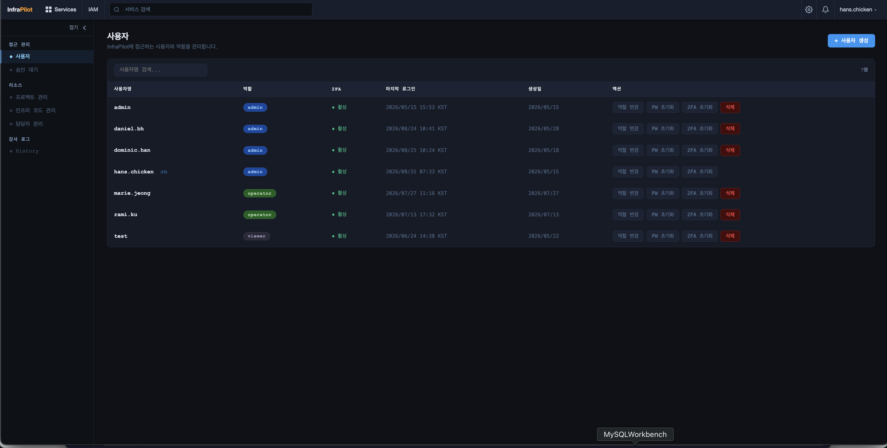 | 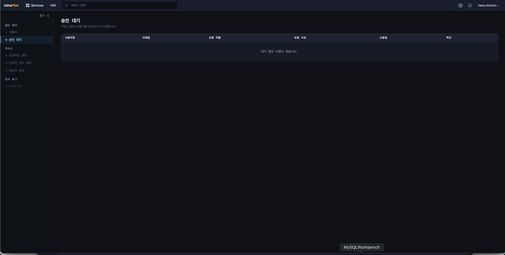 | 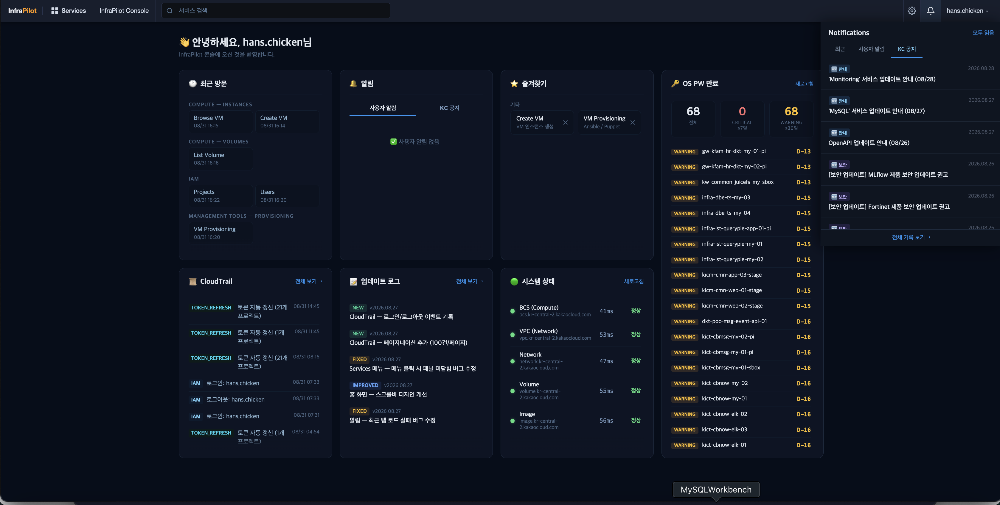 |

- **역할 체계** — `admin` / `operator` / `viewer` 3단계
- **가입 승인 워크플로** — 사용자 가입 요청 → 관리자 승인/거절 → 알림
- **보안 기능** — 임시 비밀번호 발급, 비밀번호 변경 강제, TOTP 2FA 초기화
- **SSH 패스워드 만료 알림** — 매일 오전 6시 KST 백그라운드 체크, 30일 이내 만료 시 알림
- **CloudTrail** — 모든 IAM·VM·Ansible·Puppet 작업 이력 기록

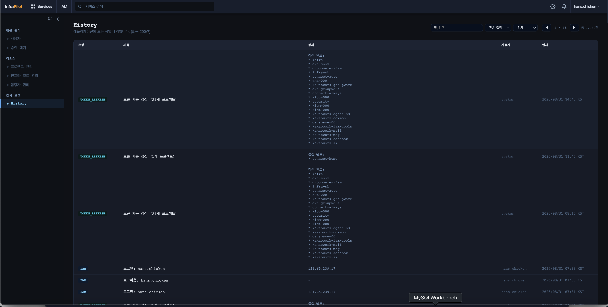

---

### 10. 인프라 코드 관리

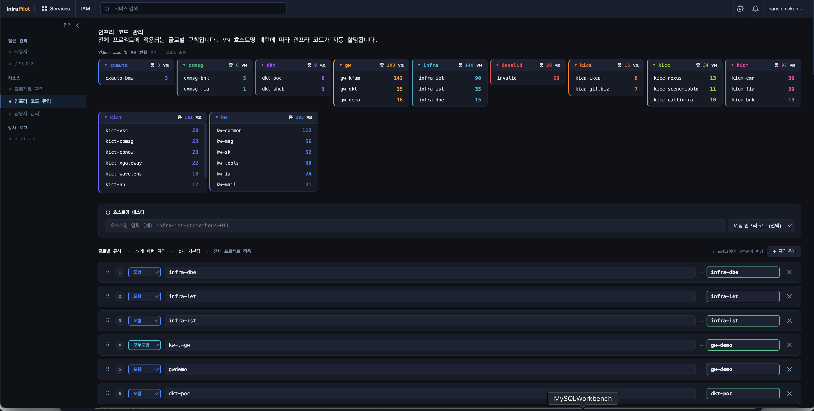

S-Code 분류 규칙과 각 코드별 담당 엔지니어·개발자·매니저를 UI에서 직접 관리.  
규칙 변경은 DB에 즉시 반영되며 재배포 없이 전 페이지에 적용됨.

---

### 11. 프로젝트 관리

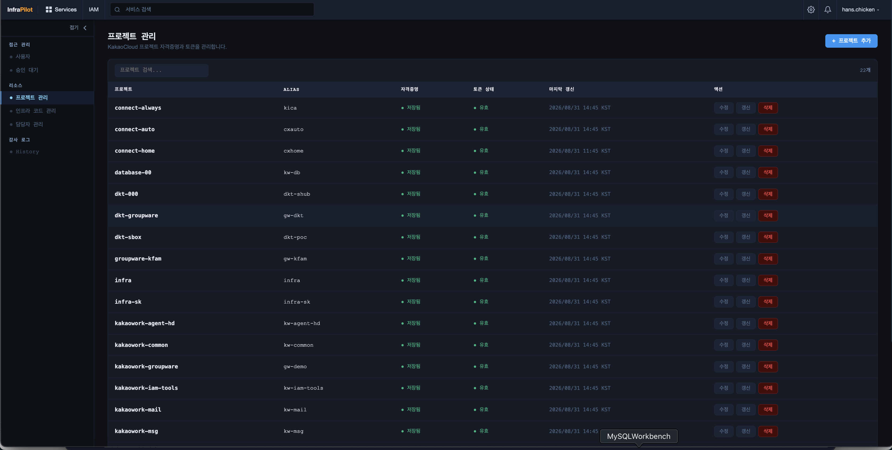

KakaoCloud 프로젝트(Access ID + Secret Key)를 DB에 등록하면 자동으로 토큰을 발급하고,  
백그라운드 스레드가 6시간마다 토큰을 자동 갱신함.

```
_refresh_all_tokens (background thread, 30분 주기 체크)
    → 토큰 발급 후 6시간 경과 시 자동 갱신
    → .tokens 파일 재생성 → 갱신 이력 CloudTrail 기록
```

---

### 12. 패치 노트

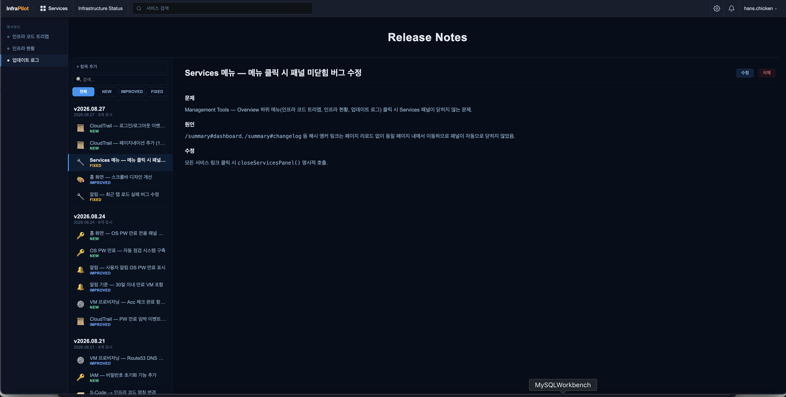

플랫폼 업데이트 이력을 `NEW` / `IMPROVED` / `FIXED` 3가지 유형으로 버전별 관리.  
관리자가 UI에서 직접 작성·수정·삭제 가능하며 이미지 첨부 지원.

---

### 13. 인증 — 2FA 및 라이트 모드

| 로그인 | 2FA 설정 | 라이트 모드 |
|---|---|---|
| 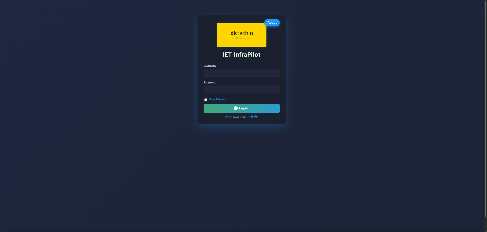 | 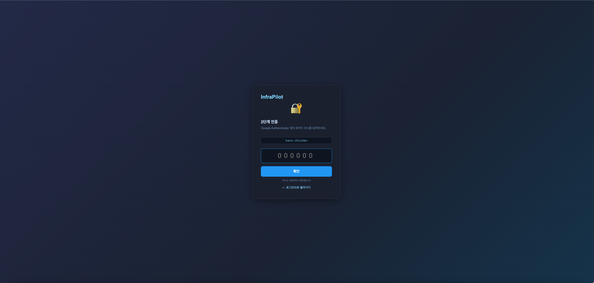 | 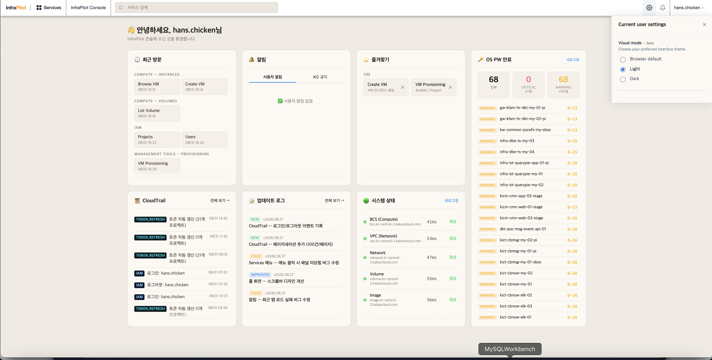 |

- **TOTP 2FA** — 첫 로그인 시 QR 코드 발급, Google Authenticator 등 호환
- **세션 관리** — 1시간 비활동 시 자동 만료, remember me 9시간
- **Rate limiting** — 로그인 10회/분 IP 제한 (flask-limiter)
- **라이트/다크 모드** 전환 지원

---

## Architecture

```
┌─────────────────────────────────────────────────────────┐
│                    DIPO Web App (Flask)                  │
│                                                         │
│  ┌─────────┐  ┌──────────┐  ┌────────────────────────┐ │
│  │  Routes  │  │ Background│  │    Celery Workers      │ │
│  │ (app.py) │  │ Threads  │  │  (볼륨 생성/연결)       │ │
│  └────┬─────┘  └────┬─────┘  └──────────┬─────────────┘ │
│       │              │                   │               │
│  ┌────▼─────────────▼───────────────────▼─────────────┐ │
│  │              SQLite DB (infrapilot.db)              │ │
│  │  users · projects · scode_rules · app_history · …  │ │
│  └─────────────────────────────────────────────────────┘ │
│                         │                               │
│              ┌──────────▼──────────┐                    │
│              │    Redis (db=0,1)    │                    │
│              │  Celery broker/back  │                    │
│              │  VM list cache(60s)  │                    │
│              └─────────────────────┘                    │
└───────────────────────────┬─────────────────────────────┘
                            │ SSH (Paramiko) / API calls
          ┌─────────────────┼─────────────────────┐
          ▼                 ▼                     ▼
   KakaoCloud API    Ansible Server        Puppet Master
  (VM·Volume·VPC)   (ansible-playbook)   (puppetserver ca)
```

---

## File Structure

```
dipo/
├── app.py              # Flask 앱 — 전체 라우트 및 프로비저닝 로직 (4,700+ 줄)
├── models.py           # SQLAlchemy 모델 15개 (users, projects, scode_rules 등)
├── helpers.py          # 공통 헬퍼 — SSH, KakaoCloud API, S-Code, Ansible 인벤토리
├── background.py       # 백그라운드 스레드 — 토큰 갱신, PW 만료 체크, VM 캐시 프리워밍
├── celery_app.py       # Celery 비동기 태스크 — 볼륨 생성/연결
├── vm_create.py        # VM 생성 기능 — KakaoCloud API 래퍼 (paginate, retry)
├── env_manager.py      # .tokens / .project_id 파일 핫 리로드
├── extensions.py       # Flask 익스텐션 초기화 (db, csrf, login_manager, limiter)
├── templates/          # Jinja2 HTML 템플릿
├── static/             # CSS, JS, 이미지
│   ├── css/
│   ├── js/
│   └── images/
├── update_log/         # 패치 노트 DB 시딩 스크립트
└── docs/               # 기능별 스크린샷 (21장)
```

---

## DB Schema (주요 테이블)

| 테이블 | 역할 |
|---|---|
| `users` | 사용자 계정 · 역할 · 2FA · 상태 |
| `projects` | KakaoCloud 프로젝트 (Access ID · Secret Key · 토큰) |
| `scode_rules` | S-Code 분류 규칙 (우선순위 · 매칭 방식) |
| `scode_info` | S-Code별 담당자 (engineer · developer · manager) |
| `scode_snapshots` | 일별 S-Code VM 수 스냅샷 |
| `scode_vm_snapshots` | 일별 VM-S-Code 매핑 스냅샷 |
| `app_history` | CloudTrail — 전체 작업 이력 |
| `notifications` | SSH PW 만료 알림 |
| `app_changelog` | 패치 노트 (NEW · IMPROVED · FIXED) |
| `user_activity` | 사용자별 최근 방문 페이지 (최대 6개) |
| `user_favorites` | 사용자 즐겨찾기 |

---

## Background Threads

| 스레드 | 주기 | 역할 |
|---|---|---|
| `_refresh_all_tokens` | 30분 체크, 6시간 만료 | KakaoCloud 토큰 자동 갱신 |
| `_prewarm_vm_cache` | 55초 | 전 프로젝트 VM 목록 Redis 캐시 유지 |
| `_schedule_scode_snapshot` | 매일 07:00 KST | S-Code 일별 스냅샷 |
| `_schedule_pw_check` | 매일 06:00 KST + 기동 시 즉시 | SSH PW 만료 체크 |

> 멀티 워커 환경에서 백그라운드 스레드가 중복 실행되지 않도록 `fcntl` 파일 락으로 단일 워커만 스레드 보유.

---

## Security

- **인증** — TOTP 2FA 필수, 세션 1시간 비활동 만료
- **접근 제어** — `@require_role` 데코레이터로 라우트별 역할 제한
- **Rate limiting** — 로그인 10회/분 (IP 기준)
- **CSRF 보호** — Flask-WTF CSRF 토큰 전 폼 적용
- **자격증명 관리** — SSH 패스워드·API 키는 환경변수 또는 `/etc/mgt-api/` 파일에서 로드. 코드에 하드코딩하지 않음

---

## Tech Stack

- **Python 3** · **Flask** · **Flask-Login** · **Flask-WTF** · **Flask-Limiter**
- **SQLAlchemy** · **SQLite**
- **Celery** · **Redis**
- **Paramiko** — SSH/SFTP 자동화
- **Pandas** — VM 데이터 집계 및 필터링
- **pyotp** · **qrcode** — TOTP 2FA
- **boto3** — AWS Route53 A레코드 등록
- **KakaoCloud BCS/VPC/Volume/Image API** — 인프라 제어
- **Ansible** · **Puppet** — 구성 관리 연동
